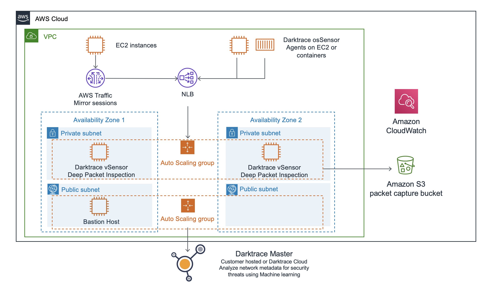
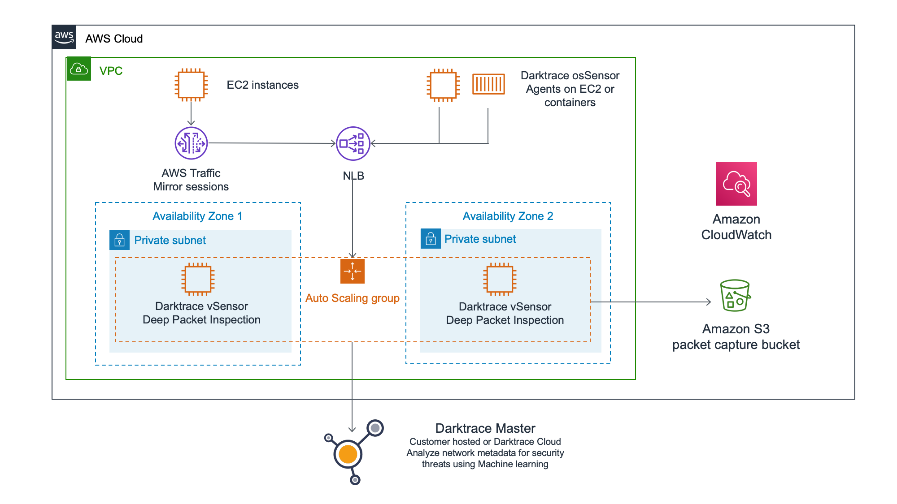

This Quick Start provides two possible deployment architectures.

=== Deployment without existing VPC

.Quick Start architecture for {partner-product-name} for a new VPC on AWS
[link=images/architecture_diagram.png]

Using the New VPC Deployment, as shown in *Figure 1*, the Quick Start deploys the following:

* A highly available architecture that spans two Availability Zones.
* A VPC configured with public and private subnets, according to AWS best practices, to provide you with your own virtual network on AWS, via the https://github.com/aws-quickstart/quickstart-aws-vpc[AWS VPC Quick Start^].

* Two private subnets populated with:

    - Managed network address translation (NAT) gateways to allow outbound
    internet access for resources in the private subnets.
    - The main vSensor Deployment (as described below)

* Two public subnets populated with:

    - A Linux bastion host in an Auto Scaling Group (using the https://aws-quickstart.github.io/quickstart-linux-bastion/[AWS Bastion Quick Start^]) to allow inbound Secure
    Shell (SSH) access to EC2 instances (primarily vSensor Instances) in each private subnet.

All subnets created are free for your own use to deploy EC2 resources to be mirrored by the vSensor deployment.

=== Deployment into existing VPC

.Quick Start architecture for {partner-product-name} for an existing VPC on AWS
[link=images/architecture_diagram.png]

You can also deploy just the vSensor stack into your own exisiting VPC and subnets.

The main *vSensor Workload Stack* provides the following resources:

* Generated AMI containing the latest vSensor software at the time of building.
* An Auto-Scaling Group (ASG) of vSensor EC2 instances using the generated AMI, configured with a Launch Template. A multiple instance ASG configuration will allow for High Availability operation across 2 Availability Zones.
* CloudWatch Alarms that allow the ASG to resize and match traffic ingestion demand.
* CloudWatch Log Groups and metric collection from vSensors.
* Traffic Mirroring Filters and Target for allowing EC2 Instances to be mirrored.
* An Elastic Network Load Balancer (NLB) to distribute monitored traffic from Traffic Mirroring Sessions and osSensors across the ASG.
* An S3 Bucket to store mirrored traffic packets, to be queried by a Darktrace Master Appliance. The lifetime history of packets stored is configurable.
