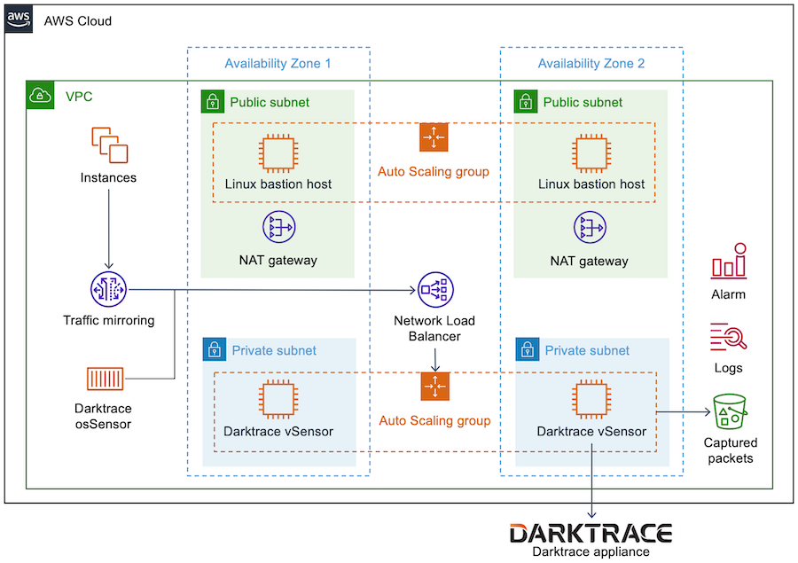

Deploying this Quick Start for a new virtual private cloud (VPC) with
default parameters builds the following {partner-product-short-name} environment in the
AWS Cloud.

:xrefstyle: short
[#architecture1]
.Quick Start architecture for {partner-product-short-name} on AWS

As shown in <<architecture1>>, the Quick Start sets up the following:

* A highly available architecture that spans two Availability Zones.
* A virtual private network (VPC) configured with public and private subnets, according to AWS best practices, to provide you with your own virtual network on AWS.
* A VPC traffic mirror session to send mirrored traffic between customer EC2 instances to a Network Load Balancer.
* A Network Load Balancer to route mirrored VPC traffic to Darktrace vSensor instances in the private subnets.
* In the public subnets:
** Managed network address translation (NAT) gateways to allow outbound internet access for resources in the private subnets.*
** A Linux bastion host in an Auto Scaling group to allow inbound Secure Shell (SSH) access to Amazon Elastic Compute Cloud (Amazon EC2) instances in public and private subnets.*
* In the private subnets, an Auto Scaling group of Amazon EC2 instances configured with Darktrace vSensor. 
* An Amazon Simple Storage Service (Amazon S3) bucket to store packets captured by Darktrace vSensor. A Darktrace appliance queries data in the S3 bucket to run threat analysis.
* Amazon CloudWatch to provide:
** CloudWatch alarms to invoke dynamic scaling of the Darktrace vSensor Auto Scaling group.
** CloudWatch Logs to collect metrics from Darktrace vSensor EC2 instances.

[.small]#*The template that deploys the Quick Start into an existing VPC skips the components marked by asterisks and prompts you for your existing VPC configuration.#

